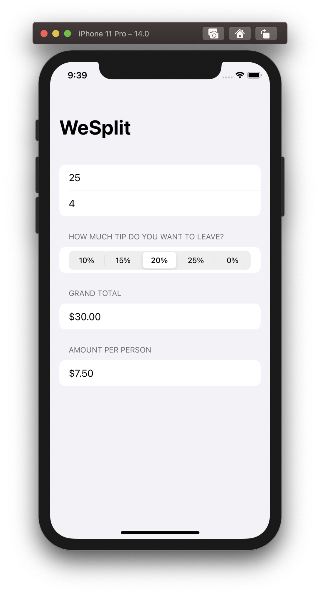
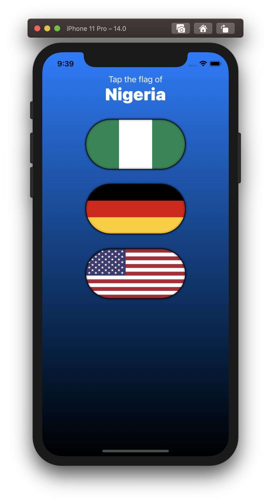
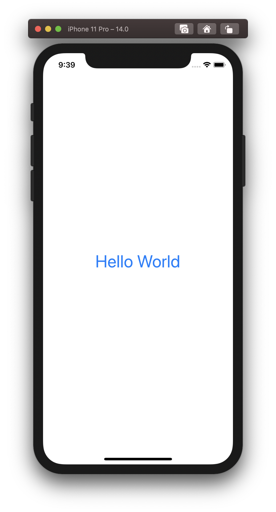
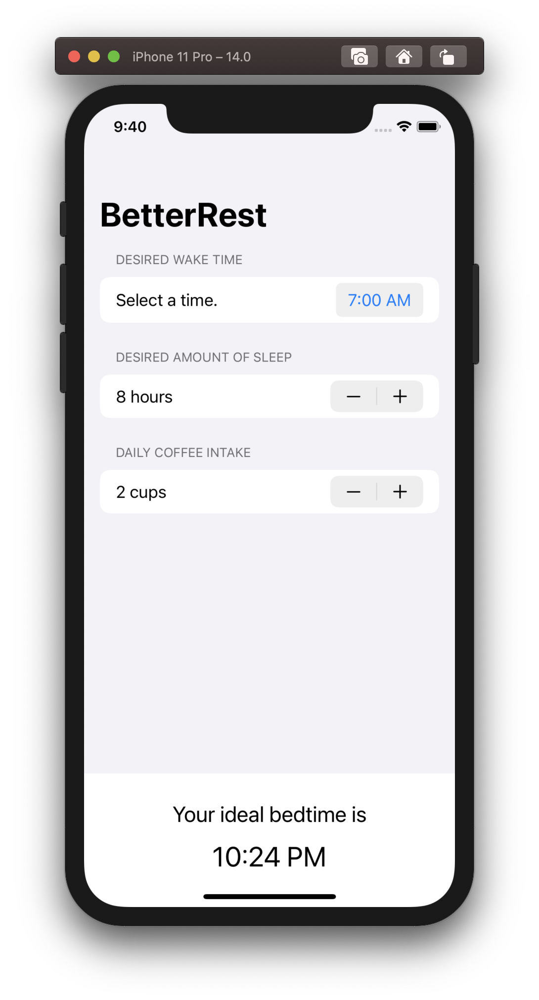

# 100 Days of SwiftUI

Working my way through Paul Hudson's [100 Days of SwiftUI](https://www.hackingwithswift.com/100/swiftui)!

Note that the first 15 days teach Swift, not SwiftUI. I opted to skip these lessons as I already have experience with Swift.

| Description | Image |
| ------------- | ------------- |
| **Day 16: WeSplit**   A simple application to calculate tips and split the bill between friends. |  |
| **Day 17: GuessTheFlag**   A game where you guess the country of the given flag. |  |
| **Day 18: ViewsAndModifiers**   A test application that is more about learning how to use views and modifiers than creating anything. Lessons from this day were applied to the two previous projects. |  |
| **Day 19: BetterRest**   An application to calculate your ideal bedtime using machine learning. |  |
