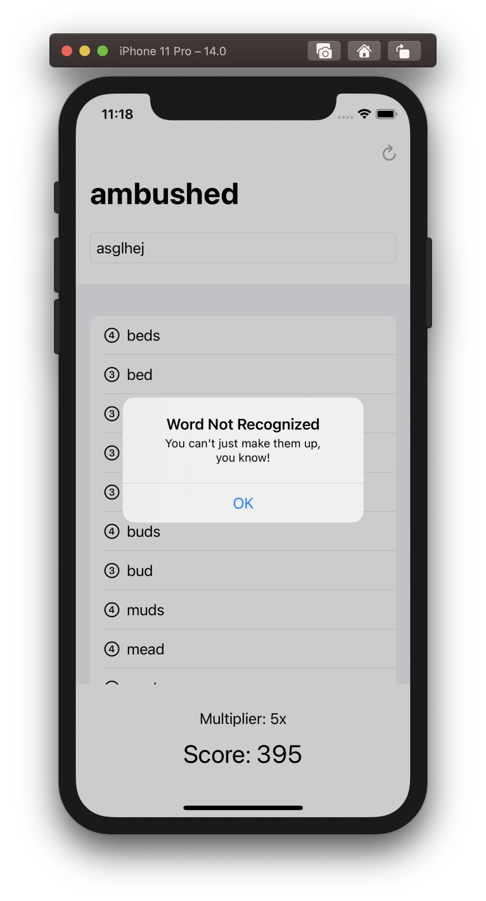
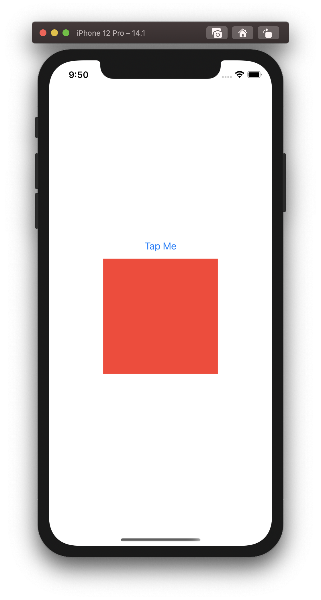
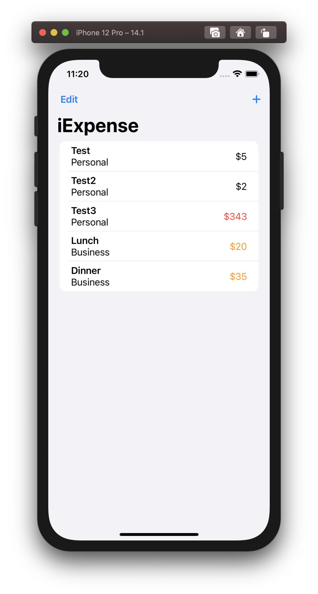
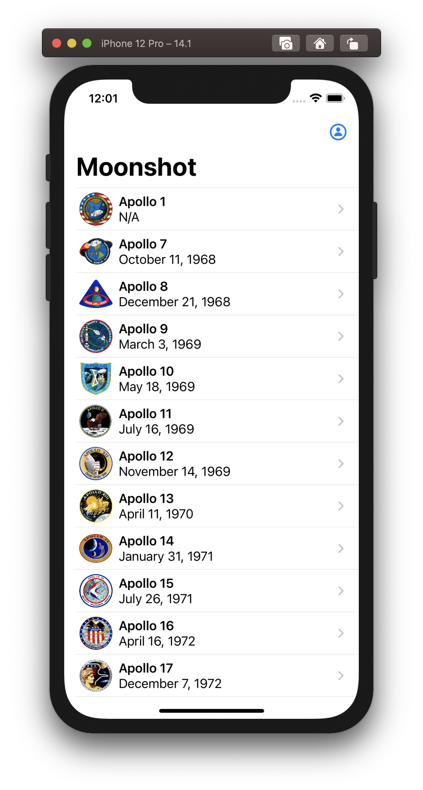
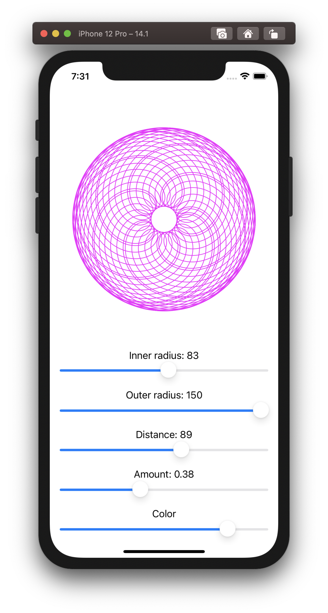
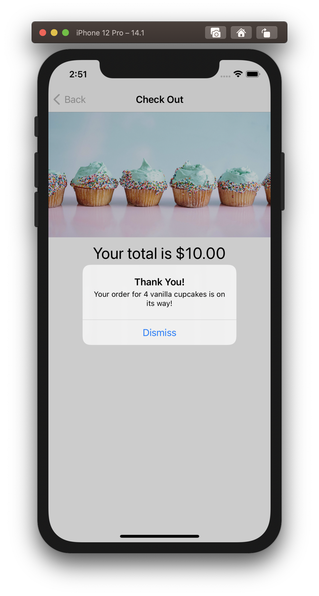
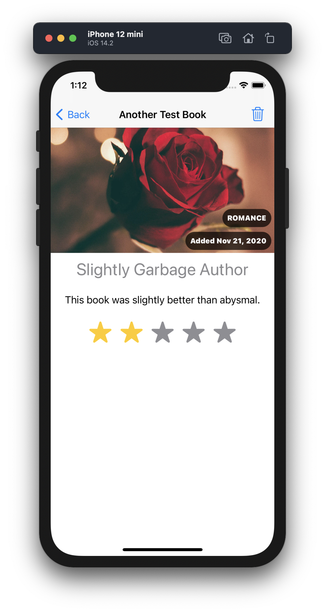
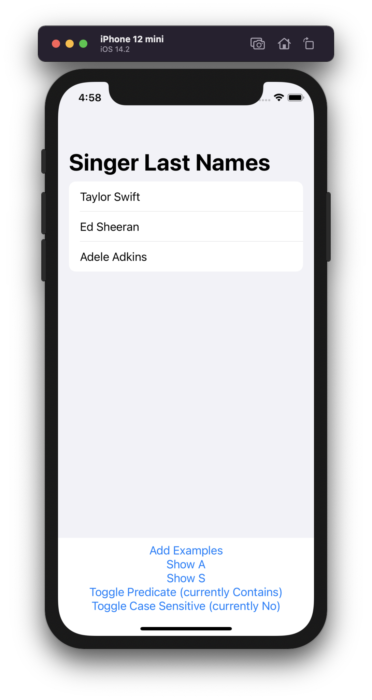

# 100 Days of SwiftUI

Working my way through Paul Hudson's [100 Days of SwiftUI](https://www.hackingwithswift.com/100/swiftui)!

Note that the first 15 days teach Swift, not SwiftUI. I opted to skip these lessons as I already have experience with Swift.

| Description | Image |
| ------------- | ------------- |
| **Day 16: WeSplit**   A simple application to calculate tips and split the bill between friends. |  |
| **Day 17: GuessTheFlag**   A game where you guess the country of the given flag. |  |
| **Day 18: ViewsAndModifiers**   A test application that is more about learning how to use views and modifiers than creating anything. Lessons from this day were applied to the two previous projects. |  |
| **Day 19: BetterRest**   An application to calculate your ideal bedtime using machine learning. |  |
| **Day 20: WordScramble**   A word game where you try to make as many words as possible from a given root word. |  |
| **Day 21: Animations**   Another test application that shows how animations work and interact. Lessons from this day were applied to GuessTheFlag. |  |
| **Day 22: iExpense**   An application that persistently stores expenses that you enter, and allows deletion of those expenses. |  |
| **Day 23: Moonshot**   An application for viewing details about various NASA missions and their crewmembers. |  |
| **Day 24: Drawing**   A test application that demonstrates how to draw shapes on screen an animate them. |  |
| **Day 25: Cupcake Corner**   An application for ordering cupcakes, demonstrating how to send and receive `Codable` JSON data over the Internet. |  |
| **Day 26: Bookworm**   An application for tracking books and their reviews, using Core Data to persist the contents. |  |
| **Day 27: CoreDataProject**   A technique application that investigates more of the complex aspects of Core Data. |  |
